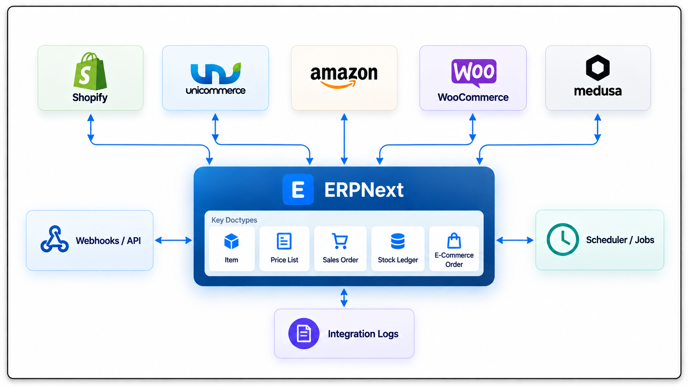

<div align="center">
	<a href="https://github.com/aerele/ecommerce-core">
		
	</a>
	<h2>Ecommerce Core</h2>
	<p align="center">Shared foundation for standalone ERPNext ecommerce integrations</p>

[](https://github.com/aerele/ecommerce-core/actions/workflows/ci.yml)
[](https://github.com/aerele/ecommerce-core/actions/workflows/linters.yml)
[](license.txt)
</div>
<br>
<div align="center">
	
</div>
<br>

<div align="center">
    <a href="https://integrations.frappe.cloud/integrations/ecommerce-integration/ecommerce-core/developer-documentation/overview-architecture">Documentation</a>
    -
	<a href="https://github.com/aerele/ecommerce-core">Repository</a>
	-
	<a href="https://github.com/aerele/ecommerce-core/blob/develop/AGENTS.md">AI Development Guide</a>
</div>

## Ecommerce Core

Ecommerce Core provides the shared contracts and provider-neutral infrastructure used by standalone ecommerce connector apps on Frappe and ERPNext. It centralizes the common models, workflows, and utilities while keeping provider-specific APIs, authentication, webhooks, and business logic inside separate connector apps.

Ecommerce Core is not an ecommerce connector by itself. Install a compatible connector app to integrate ERPNext with a supported ecommerce platform.

### Key Features

- **Product mapping**: Maintain mappings between ERPNext items and ecommerce platform products and variants.
- **Integration logs**: Record synchronization jobs, retries, and errors across connector apps.
- **Warehouse mapping**: Map platform locations to ERPNext warehouses.
- **Inventory synchronization**: Detect stock changes and synchronize inventory across channels.
- **Scheduling**: Provide configurable synchronization intervals for connector apps.
- **Customer management**: Create and reuse ERPNext customers from ecommerce orders.
- **Address mapping**: Convert platform addresses into ERPNext-compatible records.
- **Tax and pricing utilities**: Provide shared tax and price list safeguards for integrations.
- **Shared utilities**: Reuse common controllers, client scripts, and helper functions across connector apps.

<details>
<summary>Under the Hood</summary>

- [**Frappe Framework**](https://github.com/frappe/frappe): A full-stack web application framework written in Python and JavaScript. The framework provides a robust foundation for building web applications, including a database abstraction layer, user authentication, and a REST API.

- [**ERPNext**](https://github.com/frappe/erpnext): The open-source ERP that remains the source of truth for items, stock, accounting and sales documents. Ecommerce Core maps provider data onto ERPNext masters and transactions.

- [**Connector Apps**](https://integrations.frappe.cloud/integrations/ecommerce-integration/ecommerce-core/developer-documentation/overview-architecture): Implement provider-specific APIs, authentication, webhooks, synchronization workflows, and business logic on top of Ecommerce Core.

</details>

### Compatibility

| Frappe Version | ERPNext Version | Python Version |
| -------------- | --------------- | -------------- |
| Version 16 (`develop`) | Version 16 (`develop`) | 3.14+ |

## Installation

Ecommerce Core targets Frappe and ERPNext version 16 through the `develop` branch.

Set up a Frappe bench by following the [Frappe installation guide](https://docs.frappe.io/framework/user/en/installation), then install ERPNext and Ecommerce Core:

```sh
bench get-app erpnext --branch develop
bench get-app https://github.com/aerele/ecommerce-core --branch develop
bench --site <site-name> install-app erpnext
bench --site <site-name> install-app ecommerce_core
```

Install a compatible connector app after Ecommerce Core. Refer to the connector's documentation for provider-specific configuration.

## Building a Connector

A standalone ecommerce connector should:

1. Declare `required_apps = ["ecommerce_core"]` in `hooks.py`.
2. Implement the required settings controller and shared contracts provided by Ecommerce Core.
3. Keep provider-specific APIs, authentication, webhooks, and business logic inside the connector app.
4. Reuse the shared models, utilities, and synchronization workflows provided by Ecommerce Core.

See the [Developer Documentation](https://integrations.frappe.cloud/integrations/ecommerce-integration/ecommerce-core/developer-documentation/overview-architecture) for the connector architecture and integration workflow.

For AI-assisted development, see the [AI Development Guide](AGENTS.md), which defines the implementation contract and development guidelines.

## Learning and Community

1. [Frappe School](https://frappe.school) - Learn Frappe Framework and ERPNext from the various courses by the maintainers or from the community.
2. [Official documentation](https://docs.frappe.io/framework) - Extensive documentation for Frappe Framework.
3. [Discussion Forum](https://discuss.frappe.io/) - Engage with the community of ERPNext users and service providers.

## Contributing

1. [Contributing Guide](.github/CONTRIBUTING.md)
2. [Issue Guidelines](https://github.com/frappe/erpnext/wiki/Issue-Guidelines)
3. [Pull Request Requirements](https://github.com/frappe/erpnext/wiki/Contribution-Guidelines)
4. Send pull requests to the `develop` branch only.

## License

GNU GPL v3.0. See [license.txt](license.txt).

<br>
<br>
<div align="center">
  <a href="https://aerele.in">
    <picture>
      <source media="(prefers-color-scheme: dark)" srcset="./ecommerce_core/public/images/aerele-dark.png">
      
    </picture>
  </a>
</div>